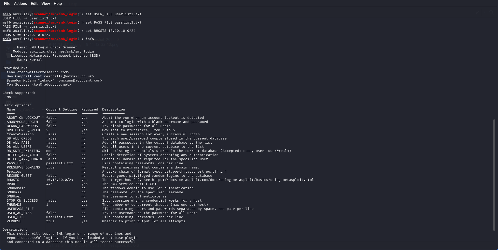

# INTERNAL NETWORK PENETRATION TESTING

## For: VIRTUAL INFOSEC AFRICA KNUST

## Submitted By:AZINGYA COSMOS

## Table of Contents
- [Table of Contents](#table-of-contents)
- [Executive Summary](#executive-summary)
- [Analysis of Overall Security Posture](#analysis-of-overall-security-posture)
- [Key Recommendations](#key-recommendations)
- [Testing Methodology](#testing-methodology)
- [Summary Findings](#summary-findings)
- [Detailed Findings](#detailed-findings)
  - [Path Traversal and File Disclosure Vulnerability](#path-traversal-and-file-disclosure-vulnerability)
  - [Vulnerability in the MySQL Server Product of Oracle MySQL](#vulnerability-in-the-mysql-server-product-of-oracle-mysql)
  - [Wordfence](#wordfence)
  - [Remote Desktop Protocol (RDP) Use-After-Free Vulnerability](#remote-desktop-protocol-rdp-use-after-free-vulnerability)
- [CVSS v3.0 Reference Table](#cvss-v30-reference-table)

  ## Executive Summary
  
Between September 13th and September 15th, 2024, Cyberlab Internship conducted an internal penetration test on the 10.10.10.0/24 network provided by Virtual Infosec Africa. This report outlines the findings of that assessment, detailing the network security risks and vulnerabilities discovered.  

## Analysis of Overall Security Posture 
The internal network of Virtual Infosec Africa faces a High level of risk. This assessment is primarily based on the presence of a Remote Desktop Protocol (RDP) Use-After-Free Vulnerability, which can be exploited remotely without user interaction or authentication. This vulnerability poses a severe threat when RDP services are exposed to the internet.

## Key Recommendation 
Several key actions can be taken to enhance the security of Virtual Infosec Africa’s network:

Patch Management: Ensure all software and plugins are consistently updated with the latest security patches.
Access Control: Implement the principle of least privilege to minimize access to sensitive systems.
Monitoring: Regularly monitor logs, particularly for services like Apache, MySQL, and RDP, for unusual activities.
Security Best Practices: Utilize security tools such as Web Application Firewalls (WAF), Intrusion Detection Systems (IDS), and ensure proper input sanitization to mitigate vulnerabilities.

## Testing Methodology

The penetration test began by using industry-standard tools like Nmap and similar scanners to identify live hosts and services within the specified IP range. The results were manually reviewed to ensure no vulnerabilities were missed.

A qualitative risk analysis was then conducted based on the NIST Special Publication 800-30 R1 Guide for Conducting Risk Assessments, which maps vulnerabilities to risk levels according to their likelihood and impact. Further details on this risk-rating model can be found in Appendix B.

A demonstration of subdomain enumeration was conducted using tools like aiodnsbrute with the in-scope domain.

A brute force attack was executed using cewl by passing a word list.

Web-based attack surfaces were also tested using eyewitness and msfvenom.

## Summary Findings

 | Finding | Severity |
  |:-------------------:|:-----------:|
  | Remote Desktop Protocol (RDP) Use-After-Free Vulnerability | Critical|
  | Path traversal and file disclosure vulnerability | High |
  | Wordfence | Medium |
  | Vulnerability in the MySQL Server product of Oracle MySQL | Medium |

  
## Detailed Findings 
#####  Path traversal and file disclosure vulnerability
| Current Rating | CVSS |
|:-------------:|:----:|
| High | 7.5 |

##### Finding Summary

##### Evidence

##### Affected Resources
10.10.10.2, 10.10.10.30, 10.10.10.45, 10.10.10.55

##### Recommendations
-Upgrade to Apache HTTP Server 2.4.51 or later to fully patch the vulnerability.

-Ensure that default configuration ("require all denied") is enforced on all directories, especially those that could potentially be exposed via alias directives.

-Disable CGI scripts if they are not necessary, as they can be an entry point for remote code

##### References
https://www.cve.org/CVERecord?id=CVE-2021-41773

#####  Vulnerability in the MySQL Server product of Oracle MySQL
| Current Rating | CVSS |
|:-------------:|:----:|
| Medium | 4.9 |

##### Finding Summary

##### Evidence

##### Affected Resources
10.10.10.5, 10.10.10.40, 
##### Recommendations
- Upgrade to MySQL versions later than 5.6.49, 5.7.31, or 8.0.21.
- Restrict network access to trusted hosts only to reduce the attack surface.
- Limit access for high-privileged users and monitor their activities closely.

##### References
https://www.cve.org/CVERecord?id=CVE-2020-14812

##### Wordfence
| Current Rating | CVSS |
|:-------------:|:----:|
| Medium | 6.4 |

##### Finding Summary

##### Evidence

##### Affected Resources
10.10.10.10

##### Recommendations
- Update Wordfence to the latest version, particularly any patch released after version 5.3.2.
- Sanitization and Escaping: Developers should ensure that any input, especially user-submitted content like image URLs, is sanitized before being stored and escaped before being output to prevent XSS.
- Limit User Permissions: Restrict access to users with high-privileged roles like contributors or authors. Use the principle of least privilege to minimize the risk of exploitation.
- Use security plugins to detect and block potential XSS attacks.
##### References
https://www.cve.org/CVERecord?id=CVE-2024-0837

##### Remote Desktop Protocol (RDP) Use-After-Free Vulnerability
| Current Rating | CVSS |
|:-------------:|:----:|
| Critical | 9.8 |

##### Finding Summary

##### Evidence

##### Affected Resources
10.10.10.11, 10.10.10.31, 10.10.10.60
##### Recommendations
- Apply the MS12-020 security patch provided by Microsoft.
- Disable RDP if not necessary, or restrict RDP access to trusted networks using firewalls.

##### References
https://www.exploit-db.com/exploits/18606

  ## CVSS v3.0 Reference Table 
  | Qualitative Rating | CVSS Score |
  |:-------------------:|:-----------:|
  | None informational | N/A |
  | Low | 0.1-3.9|
  | Medium | 4.0-6.9|
  | High | 7.0-8.9|
  | Critical | 9.0-10.0 |